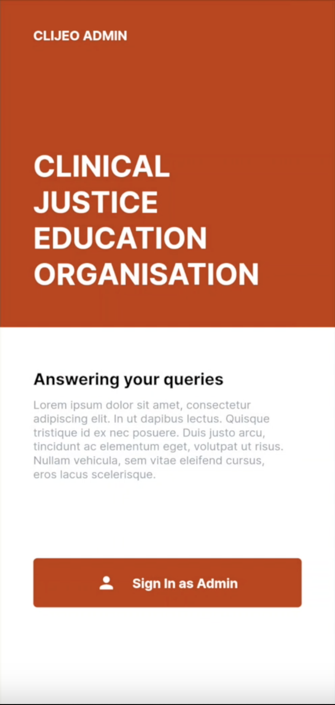
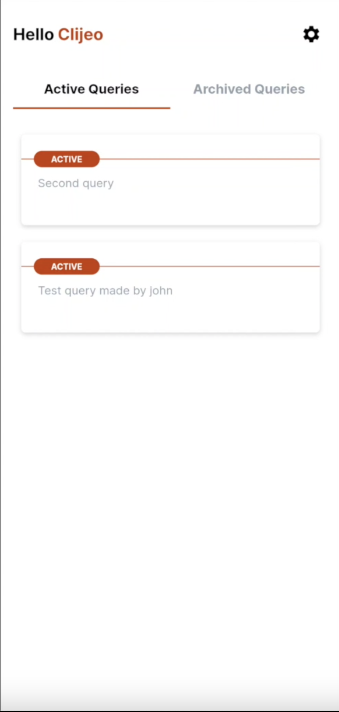
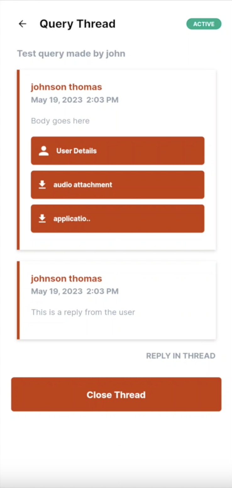
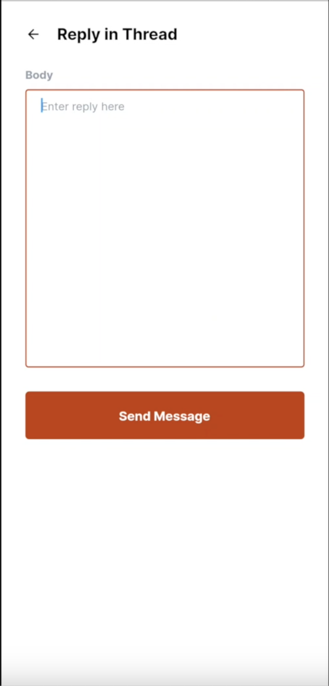
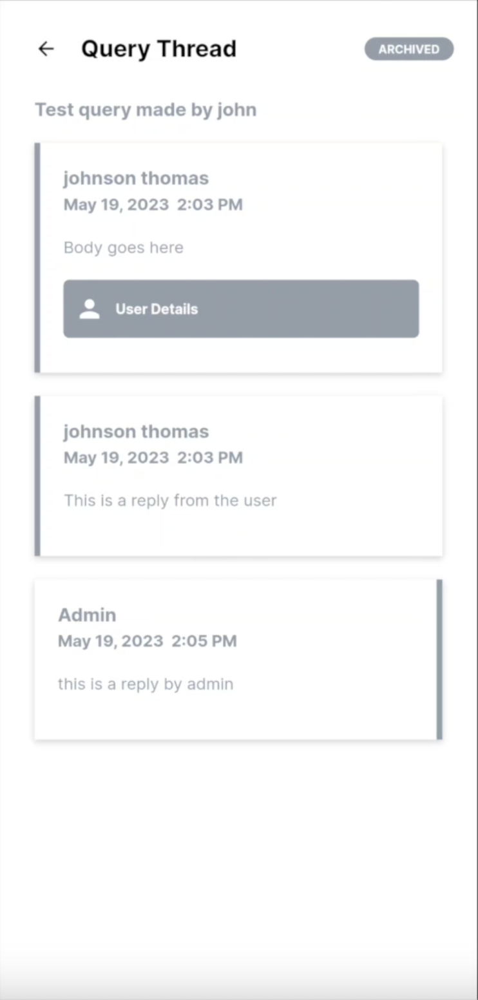

# CLIJEO (Admin App)

CLIJEO is a portal for the individuals to reach out to professionals for clarification of legal queries. The app supports the following
2. Viewing active/archived legal queries along with user details, text, voice and video/photo attachments.
3. Discuss queries with loggers via a dedicated chat interface.

The App is built in flutter using the MVC architecture. The UI is responsive and has multi-lingual support (english and malayalam). A truncated version of the directory structure is as follows
```
(base) joelmathew@Joels-MacBook-Pro clijeo-admin % tree   
.
├── README.md
├── analysis_options.yaml
├── android
├── assets
├── fonts
├── ios
├── lang
│   ├── en.json
│   └── ml.json
├── lib
│   ├── config.dart
│   ├── constants.dart
│   ├── main.dart
│   ├── controllers
│   │   ├── clijeo_user
│   │   ├── core
│   │   │   ├── api_core
│   │   │   ├── audio_playback
│   │   │   ├── auth
│   │   │   ├── error
│   │   │   ├── file
│   │   │   ├── form_validation
│   │   │   ├── language
│   │   │   ├── notification
│   │   │   └── shared_pref
│   │   ├── edit_settings_form
│   │   ├── main_app
│   │   ├── query_thread
│   │   │   ├── query_thread_attachment
│   │   └── thread_respond_from
│   ├── models
│   │   ├── attachment
│   │   ├── customer
│   │   │   └── customer_dto
│   │   ├── query
│   │   │   ├── media
│   │   │   └── query_response
│   │   ├── sign_in_response
│   │   ├── user
│   │   │   └── query
│   │   └── user_dto
│   └── view
│       ├── core
│       │   ├── common_components
│       │   └── theme
│       ├── error
│       │   └── widgets
│       ├── home
│       │   └── components
│       ├── loading
│       ├── query_thread
│       │   └── components
│       ├── settings
│       ├── sign_in
│       └── splash_screen
├── pubspec.lock
└── pubspec.yaml
```

## Screenshots



## Resources
1. [Multilingual Support](https://medium.com/flutter-community/flutter-internationalization-the-easy-way-using-provider-and-json-c47caa4212b2)
2. [UI Responsiveness](https://medium.com/flutter-community/flutter-effectively-scale-ui-according-to-different-screen-sizes-2cb7c115ea0a)
3. [Flutter State Management](https://docs.flutter.dev/development/data-and-backend/state-mgmt/simple) ([ref](https://medium.com/flutter-community/making-sense-all-of-those-flutter-providers-e842e18f45dd), [ref](https://codewithandrea.com/videos/flutter-state-management-setstate-freezed-state-notifier-provider/))
4. [Google Sign-in](https://medium.com/swlh/google-sign-in-with-auto-login-in-flutter-93281747bed4)
